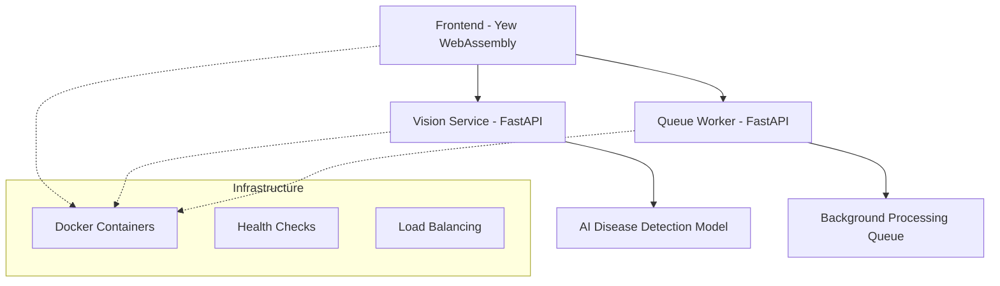

# 🌾 AI4Thai Crop Guardian
[](https://github.com/your-repo/ai4thai-crop-guardian/actions)
[](https://github.com/your-repo/ai4thai-crop-guardian/actions)
[](LICENSE)

> Production-ready AI-powered crop disease detection system for Thai farmers

AI4Thai Crop Guardian is a comprehensive platform that leverages computer vision and machine learning to help Thai farmers detect and treat crop diseases efficiently. Built with modern web technologies and deployed on cloud infrastructure.

## 🏗️ Architecture Overview



### 🎯 Core Components

#### 🖥️ Frontend (`/frontend`)
- **Technology**: Rust + Yew WebAssembly framework
- **Purpose**: Progressive Web App with real-time image analysis
- **Features**:
  - Responsive image upload interface
  - Real-time analysis feedback
  - Thai language localization
  - Offline-capable PWA
  - Mobile-optimized UI

#### 🔬 Vision Service (`/backend/vision-service`)
- **Technology**: Python + FastAPI + Computer Vision
- **Purpose**: AI-powered crop disease detection
- **Features**:
  - Multi-format image processing (JPEG, PNG, WebP)
  - Disease classification with confidence scores
  - Treatment recommendations
  - Performance monitoring
  - Comprehensive validation

#### ⚡ Queue Worker (`/backend/queue-worker`)
- **Technology**: Python + FastAPI + Background Processing
- **Purpose**: Asynchronous job management and processing
- **Features**:
  - Non-blocking image analysis
  - Job status tracking
  - Result caching
  - Error handling and retry logic
  - Thread-safe operations

## 🚀 Quick Start

### Prerequisites
- Docker & Docker Compose
- Git
- Internet connection (for AI model downloads)

### Installation

```bash
# Clone the repository
git clone https://github.com/your-repo/ai4thai-crop-guardian.git
cd ai4thai-crop-guardian

# Copy environment template
cp .env.template .env

# Development (local services with hot reload)
make dev

# Production (Docker containers)
make prod

# Check service health
make health
```

### Development Setup

**Prerequisites:**
- Docker & Docker Compose (for production)
- Python 3.8+ (for local development)
- Rust + Cargo (https://rustup.rs/)
- Make

**Available Commands:**
```bash
make help     # Show all available commands
make dev      # Start development environment
make prod     # Start production environment
make test     # Run all tests
make lint     # Run code quality checks
make stop     # Stop all services
make clean    # Clean up containers and build artifacts
```

## 📁 Project Structure

```
ai4thai-crop-guardian/
├── README.md                   # Project documentation
├── Makefile                    # Development and deployment commands
├── docker-compose.yml          # Service orchestration
├── .env.template               # Environment configuration template
├── .pre-commit-config.yaml     # Code quality automation
├── LICENSE                     # MIT license
│
├── frontend/                   # Yew WebAssembly Application
│   ├── src/
│   │   ├── simple_app.rs      # Main application component
│   │   ├── components/        # Reusable UI components
│   │   ├── services/          # HTTP client services
│   │   └── types.rs           # Type definitions
│   ├── Dockerfile             # Multi-stage production build
│   ├── Trunk.toml             # Wasm build configuration
│   └── Cargo.toml             # Rust dependencies
│
└── backend/                    # Python Microservices
    ├── vision-service/         # AI Disease Detection API
    │   ├── app.py             # FastAPI application
    │   ├── Dockerfile         # Production container
    │   └── requirements.txt   # Python dependencies
    │
    └── queue-worker/           # Background Processing Service
        ├── app.py             # Job queue management
        ├── Dockerfile         # Production container
        └── requirements.txt   # Python dependencies
```

## 🔧 Configuration

### Environment Variables

Copy `.env.template` to `.env` and customize as needed:

```bash
cp .env.template .env
```

Default configuration:
```env
# Service Ports
FRONTEND_PORT=8080
VISION_SERVICE_PORT=2001
QUEUE_WORKER_PORT=8001

# Logging
LOG_LEVEL=INFO

# Docker Environment (development/production)
ENVIRONMENT=development
```

### Service URLs

- **Frontend**: http://localhost:8080
- **Vision Service**: http://localhost:2001
- **Queue Worker**: http://localhost:8001
- **API Documentation**: http://localhost:2001/docs

## 🧪 Testing

```bash
# Run all tests
make test

# Run code quality checks
make lint

# Format code
make format
```

## 📈 Performance & Monitoring

### Health Checks
```bash
# Check all services
make health

# Manual health checks
curl http://localhost:2001/health  # Vision Service
curl http://localhost:8001/health  # Queue Worker
```

## 🌐 Deployment

### Production Deployment

```bash
# Start production environment
make prod

# Check deployment health
make health

# Stop services
make stop

# Clean up
make clean
```

### Cloud Deployment
Support for:
- **AWS**: ECS, ECR, ALB
- **Google Cloud**: Cloud Run, GKE
- **Azure**: Container Instances, AKS

## 🤝 Contributing

1. Fork the repository
2. Create a feature branch: `git checkout -b feature/amazing-feature`
3. Install pre-commit hooks: `pre-commit install`
4. Make your changes and commit: `git commit -m 'Add amazing feature'`
5. Push to branch: `git push origin feature/amazing-feature`
6. Open a Pull Request

### Code Quality Standards
- **Rust**: Clippy linting, rustfmt formatting
- **Python**: Black formatting, isort imports, Ruff linting
- **Documentation**: Comprehensive docstrings and README updates
- **Testing**: Unit and integration test coverage

## 📄 License

This project is licensed under the MIT License - see the [LICENSE](LICENSE) file for details.

## 🙏 Acknowledgments

- AI4Thai Hackathon 2025 organizers
- Thai agricultural research institutions
- Open source computer vision community
- Rust and Python ecosystems

---

**Built with ❤️ for Thai farmers** 🇹🇭
