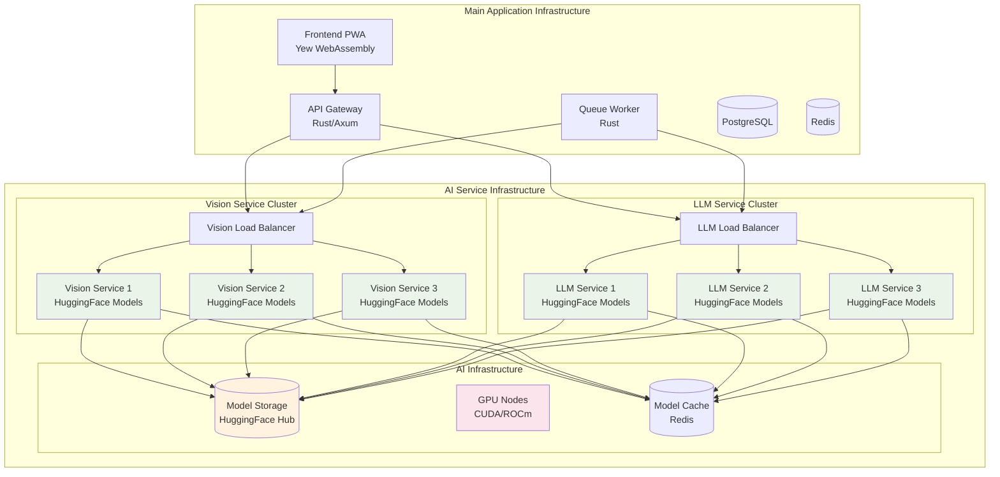

# AI Service Deployment Architecture

This document outlines the architecture for deploying AI services (Vision and LLM) separately from the main application infrastructure.

## 🎯 Overview

The AI services are deployed as independent microservices that can be scaled and managed separately from the main application. This approach provides better resource utilization, independent scaling, and easier maintenance.

## 🏗️ Architecture Design

### Deployment Architecture



## 🔧 Service Specifications

### Vision Service

#### Technology Stack
- **Framework**: FastAPI (Python)
- **ML Framework**: PyTorch + HuggingFace Transformers
- **Models**: 
  - Plant Disease Detection: `microsoft/resnet-50` (fine-tuned)
  - Crop Classification: `google/vit-base-patch16-224`
  - Image Preprocessing: Custom pipeline
- **Hardware**: GPU-enabled instances (NVIDIA T4/V100)

#### Model Configuration
```python
# Vision service models
MODELS = {
    "crop_classification": {
        "model_name": "google/vit-base-patch16-224",
        "model_path": "models/crop-classifier",
        "input_size": (224, 224),
        "batch_size": 8,
        "confidence_threshold": 0.8
    },
    "disease_detection": {
        "model_name": "microsoft/resnet-50",
        "model_path": "models/disease-detector", 
        "input_size": (256, 256),
        "batch_size": 4,
        "confidence_threshold": 0.7
    }
}
```

### LLM Service

#### Technology Stack
- **Framework**: FastAPI (Python)
- **ML Framework**: HuggingFace Transformers
- **Models**:
  - Primary: `microsoft/DialoGPT-large` (fine-tuned for agriculture)
  - Thai Language: `airesearch/wangchanberta-base-att-spm-uncased`
  - Fallback: OpenAI GPT-4 API
- **Hardware**: GPU-enabled instances (NVIDIA A100/V100)

#### Model Configuration
```python
# LLM service models
MODELS = {
    "agricultural_advisor": {
        "model_name": "microsoft/DialoGPT-large",
        "model_path": "models/agricultural-advisor",
        "max_length": 512,
        "temperature": 0.7,
        "top_p": 0.9
    },
    "thai_language": {
        "model_name": "airesearch/wangchanberta-base-att-spm-uncased",
        "model_path": "models/thai-language",
        "max_length": 256,
        "temperature": 0.8
    }
}
```

## 📁 Directory Structure

### AI Services Structure
```
ai-services/
├── vision-service/
│   ├── app.py                    # FastAPI application
│   ├── requirements.txt          # Python dependencies
│   ├── Dockerfile               # Container configuration
│   ├── models/                  # Model configurations
│   │   ├── __init__.py
│   │   ├── crop_classifier.py   # Crop classification model
│   │   ├── disease_detector.py  # Disease detection model
│   │   └── model_registry.py    # Model management
│   ├── services/                # Business logic
│   │   ├── __init__.py
│   │   ├── image_processor.py   # Image preprocessing
│   │   ├── inference_engine.py  # Model inference
│   │   └── result_formatter.py  # Response formatting
│   ├── utils/                   # Utility functions
│   │   ├── __init__.py
│   │   ├── image_utils.py       # Image utilities
│   │   ├── model_utils.py       # Model utilities
│   │   └── validation.py        # Input validation
│   ├── config/                  # Configuration
│   │   ├── __init__.py
│   │   ├── settings.py          # Application settings
│   │   └── model_config.py      # Model configurations
│   ├── tests/                   # Unit tests
│   │   ├── test_models.py
│   │   ├── test_services.py
│   │   └── test_api.py
│   └── deployment/              # Deployment configs
│       ├── docker-compose.yml
│       ├── kubernetes/
│       └── helm/
│
├── llm-service/
│   ├── app.py                   # FastAPI application
│   ├── requirements.txt         # Python dependencies
│   ├── Dockerfile              # Container configuration
│   ├── models/                 # Model configurations
│   │   ├── __init__.py
│   │   ├── agricultural_advisor.py
│   │   ├── thai_language.py
│   │   └── model_registry.py
│   ├── services/               # Business logic
│   │   ├── __init__.py
│   │   ├── chat_engine.py      # Chat processing
│   │   ├── context_manager.py  # Context management
│   │   └── response_generator.py
│   ├── prompts/                # Prompt templates
│   │   ├── agricultural_advice.txt
│   │   ├── disease_treatment.txt
│   │   └── thai_responses.txt
│   ├── utils/                  # Utility functions
│   │   ├── __init__.py
│   │   ├── text_processor.py   # Text processing
│   │   ├── translation.py      # Language translation
│   │   └── validation.py       # Input validation
│   ├── config/                 # Configuration
│   │   ├── __init__.py
│   │   ├── settings.py         # Application settings
│   │   └── model_config.py     # Model configurations
│   ├── tests/                  # Unit tests
│   │   ├── test_models.py
│   │   ├── test_services.py
│   │   └── test_api.py
│   └── deployment/             # Deployment configs
│       ├── docker-compose.yml
│       ├── kubernetes/
│       └── helm/
│
├── shared/                     # Shared utilities
│   ├── __init__.py
│   ├── auth/                   # Authentication
│   │   ├── __init__.py
│   │   └── jwt_handler.py
│   ├── monitoring/             # Monitoring utilities
│   │   ├── __init__.py
│   │   ├── metrics.py
│   │   └── health_check.py
│   ├── storage/                # Storage utilities
│   │   ├── __init__.py
│   │   ├── model_storage.py
│   │   └── cache_manager.py
│   └── utils/                  # Common utilities
│       ├── __init__.py
│       ├── logging.py
│       └── exceptions.py
│
└── deployment/                 # Deployment configurations
    ├── docker-compose.yml      # Local development
    ├── docker-compose.prod.yml # Production
    ├── kubernetes/             # Kubernetes manifests
    │   ├── namespace.yaml
    │   ├── vision-service/
    │   ├── llm-service/
    │   └── ingress/
    ├── helm/                   # Helm charts
    │   ├── ai-services/
    │   └── values/
    └── terraform/              # Infrastructure as code
        ├── main.tf
        ├── variables.tf
        └── modules/
```

## 🚀 Deployment Strategies

### 1. Local Development
```bash
# Start AI services locally
cd ai-services
docker-compose up -d

# Services available at:
# Vision Service: http://localhost:8001
# LLM Service: http://localhost:8002
```

### 2. Cloud Deployment (Kubernetes)
```bash
# Deploy to Kubernetes cluster
kubectl apply -f deployment/kubernetes/

# Or using Helm
helm install ai-services deployment/helm/ai-services/
```

### 3. Serverless Deployment
```bash
# Deploy to cloud functions
# Vision Service: AWS Lambda / Google Cloud Functions
# LLM Service: Azure Functions / AWS Lambda
```

## 📊 Resource Requirements

### Vision Service
- **CPU**: 4-8 cores
- **Memory**: 8-16 GB RAM
- **GPU**: NVIDIA T4 (16GB VRAM) or better
- **Storage**: 50GB for models and cache
- **Network**: 1Gbps for model downloads

### LLM Service
- **CPU**: 8-16 cores
- **Memory**: 16-32 GB RAM
- **GPU**: NVIDIA A100 (40GB VRAM) or V100 (32GB VRAM)
- **Storage**: 100GB for models and cache
- **Network**: 1Gbps for model downloads

## 🔍 Monitoring and Observability

### Metrics Collection
- **Model Performance**: Inference time, accuracy, throughput
- **Resource Usage**: GPU utilization, memory usage, CPU usage
- **API Metrics**: Request rate, response time, error rate
- **Business Metrics**: Detection accuracy, user satisfaction

### Health Checks
```python
# Health check endpoints
GET /health          # Basic health check
GET /health/models   # Model loading status
GET /health/gpu      # GPU availability
GET /health/ready    # Readiness probe
```

### Logging Strategy
- **Structured Logging**: JSON format with correlation IDs
- **Model Logs**: Inference results, confidence scores
- **Performance Logs**: Response times, resource usage
- **Error Logs**: Model failures, API errors

## 🔒 Security Considerations

### Authentication
- **API Keys**: Service-to-service authentication
- **JWT Tokens**: User authentication
- **mTLS**: Service mesh communication

### Data Protection
- **Model Encryption**: Encrypted model storage
- **Input Validation**: Sanitize all inputs
- **Output Filtering**: Remove sensitive information
- **Audit Logging**: Track all API calls

### Network Security
- **Private Networks**: Services in private subnets
- **Load Balancers**: SSL termination
- **Firewall Rules**: Restrict access to necessary ports
- **VPN Access**: Secure administrative access

## 🔄 CI/CD Pipeline

### Model Deployment Pipeline
```yaml
# .github/workflows/ai-services.yml
name: AI Services Deployment

on:
  push:
    paths:
      - 'ai-services/**'

jobs:
  test:
    runs-on: ubuntu-latest
    steps:
      - name: Test models
      - name: Validate configurations
      - name: Run integration tests
  
  build:
    runs-on: ubuntu-latest
    needs: test
    steps:
      - name: Build Docker images
      - name: Push to registry
      - name: Update model registry
  
  deploy:
    runs-on: ubuntu-latest
    needs: build
    steps:
      - name: Deploy to staging
      - name: Run smoke tests
      - name: Deploy to production
```

## 📈 Scaling Strategy

### Horizontal Scaling
- **Load Balancing**: Distribute requests across instances
- **Auto Scaling**: Scale based on CPU/GPU utilization
- **Queue Management**: Handle burst traffic with queues

### Vertical Scaling
- **GPU Scaling**: Upgrade to more powerful GPUs
- **Memory Scaling**: Increase RAM for larger models
- **Storage Scaling**: Add more storage for model cache

### Model Optimization
- **Model Quantization**: Reduce model size
- **Model Pruning**: Remove unnecessary parameters
- **Batch Processing**: Process multiple requests together
- **Caching**: Cache frequent predictions

---

This architecture provides a robust, scalable, and maintainable approach to deploying AI services separately from the main application infrastructure.
