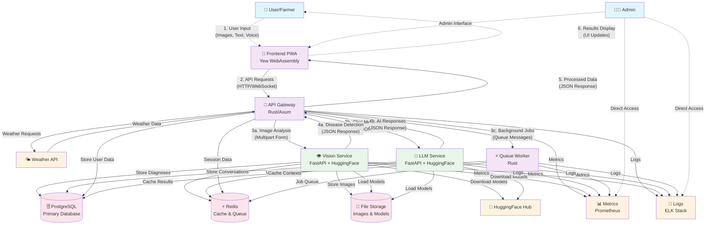
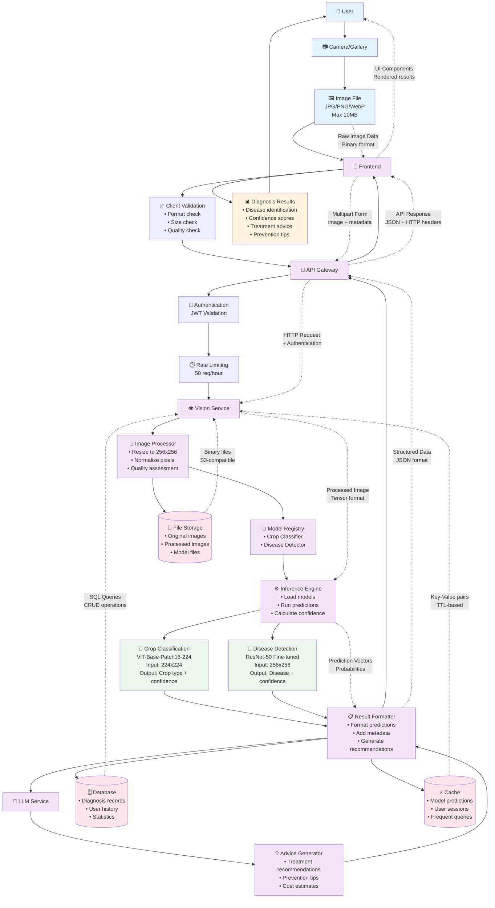
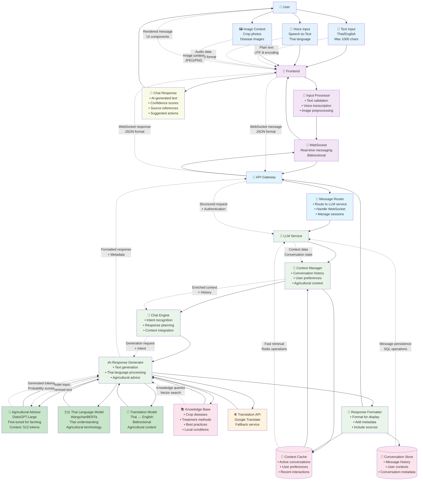

# Data Flow Diagrams

## System-Level Data Flow Diagram



## Disease Detection Data Flow



## Chat Conversation Data Flow



## User Data Flow

```mermaid
flowchart TD
    %% User Interactions
    User[👤 User/Farmer]
    Registration[📝 Registration<br/>• Personal info<br/>• Farm details<br/>• Preferences]
    Login[🔐 Login<br/>• Email/password<br/>• JWT tokens<br/>• Session data]
    ProfileUpdate[👤 Profile Update<br/>• Personal info<br/>• Farm info<br/>• Preferences]
    
    %% Frontend Layer
    Frontend[📱 Frontend PWA]
    LocalStorage[💾 Local Storage<br/>• JWT tokens<br/>• User preferences<br/>• Offline data]
    
    %% API Gateway
    Gateway[🔌 API Gateway]
    AuthMiddleware[🔐 Auth Middleware<br/>• Token validation<br/>• User identification<br/>• Permission checks]
    
    %% User Service
    UserService[👤 User Service<br/>• Profile management<br/>• Authentication<br/>• Preferences]
    
    %% Authentication Components
    JWTHandler[🎫 JWT Handler<br/>• Token generation<br/>• Token validation<br/>• Refresh logic]
    
    PasswordManager[🔒 Password Manager<br/>• Hashing (bcrypt)<br/>• Validation<br/>• Security policies]
    
    %% Data Storage
    UserDB[(👥 User Database<br/>• User profiles<br/>• Authentication data<br/>• Farm information)]
    
    SessionCache[(🔄 Session Cache<br/>• Active sessions<br/>• Refresh tokens<br/>• User contexts)]
    
    %% Analytics and Tracking
    Analytics[📊 Analytics Service<br/>• User behavior<br/>• Feature usage<br/>• Performance metrics]
    
    AuditLog[(📝 Audit Log<br/>• Login attempts<br/>• Profile changes<br/>• Security events)]
    
    %% Notification System
    NotificationService[📢 Notification Service<br/>• Email notifications<br/>• Push notifications<br/>• SMS alerts]
    
    %% External Services
    EmailProvider[📧 Email Provider<br/>SMTP service<br/>Verification emails]
    
    %% Data Flows - Registration
    User --> Registration
    Registration --> Frontend
    Frontend --> Gateway
    Gateway --> UserService
    
    UserService --> PasswordManager
    PasswordManager --> UserService
    UserService --> UserDB
    UserService --> JWTHandler
    JWTHandler --> SessionCache
    
    UserService --> NotificationService
    NotificationService --> EmailProvider
    
    UserService --> Analytics
    UserService --> AuditLog
    
    %% Data Flows - Login
    User --> Login
    Login --> Frontend
    Frontend --> LocalStorage
    Frontend --> Gateway
    Gateway --> AuthMiddleware
    AuthMiddleware --> UserService
    
    UserService --> UserDB
    UserService --> PasswordManager
    UserService --> JWTHandler
    JWTHandler --> SessionCache
    
    %% Data Flows - Profile Update
    User --> ProfileUpdate
    ProfileUpdate --> Frontend
    Frontend --> Gateway
    Gateway --> AuthMiddleware
    AuthMiddleware --> UserService
    
    UserService --> UserDB
    UserService --> Analytics
    UserService --> AuditLog
    
    %% Response Flows
    UserService --> Gateway
    Gateway --> Frontend
    Frontend --> LocalStorage
    Frontend --> User
    
    %% Background Processes
    Analytics --> UserDB
    AuditLog --> UserDB
    
    %% Data Annotations
    Registration -.->|"User form data<br/>JSON format"| Frontend
    Login -.->|"Credentials<br/>Email + password"| Frontend
    ProfileUpdate -.->|"Updated fields<br/>Partial data"| Frontend
    
    Frontend -.->|"HTTP requests<br/>+ CSRF tokens"| Gateway
    Gateway -.->|"Authenticated requests<br/>+ User context"| UserService
    
    UserService -.->|"Hashed passwords<br/>Secure storage"| UserDB
    UserService -.->|"JWT tokens<br/>Signed & encrypted"| SessionCache
    
    UserService -.->|"User events<br/>Structured logs"| Analytics
    UserService -.->|"Security events<br/>Audit trail"| AuditLog
    
    NotificationService -.->|"Email templates<br/>HTML/text"| EmailProvider
    
    %% Cache and Performance
    SessionCache -.->|"Fast token lookup<br/>Redis operations"| AuthMiddleware
    LocalStorage -.->|"Client-side cache<br/>Browser storage"| Frontend
    
    %% Styling
    classDef user fill:#e3f2fd
    classDef frontend fill:#f3e5f5
    classDef gateway fill:#e1f5fe
    classDef service fill:#e8f5e8
    classDef auth fill:#fff3e0
    classDef storage fill:#fce4ec
    classDef external fill:#ffecb3
    classDef analytics fill:#f1f8e9
    
    class User,Registration,Login,ProfileUpdate user
    class Frontend,LocalStorage frontend
    class Gateway,AuthMiddleware gateway
    class UserService service
    class JWTHandler,PasswordManager auth
    class UserDB,SessionCache storage
    class EmailProvider external
    class Analytics,AuditLog,NotificationService analytics
```

## System Integration Data Flow

```mermaid
flowchart TD
    %% External Data Sources
    WeatherAPI[🌤️ Weather API<br/>OpenWeatherMap<br/>Real-time data]
    
    HuggingFace[🤗 HuggingFace Hub<br/>Model repository<br/>Pre-trained models]
    
    ExternalAPIs[🌐 External APIs<br/>• Translation services<br/>• SMS providers<br/>• Email services]
    
    %% Core System
    APIGateway[🔌 API Gateway<br/>Central orchestrator]
    
    %% Services
    VisionService[👁️ Vision Service<br/>Image analysis]
    LLMService[🧠 LLM Service<br/>Text generation]
    QueueWorker[⚡ Queue Worker<br/>Background processing]
    
    %% Data Processing Pipeline
    DataPipeline[🔄 Data Pipeline<br/>• ETL processes<br/>• Data validation<br/>• Transformation]
    
    %% Storage Systems
    PrimaryDB[(🗄️ Primary Database<br/>PostgreSQL<br/>Transactional data)]
    
    AnalyticsDB[(📊 Analytics Database<br/>Time-series data<br/>Metrics & logs)]
    
    CacheLayer[(⚡ Cache Layer<br/>Redis<br/>Fast access data)]
    
    FileStorage[(📁 File Storage<br/>S3-compatible<br/>Images & models)]
    
    %% Monitoring and Observability
    MetricsCollector[📊 Metrics Collector<br/>Prometheus<br/>System metrics]
    
    LogAggregator[📝 Log Aggregator<br/>ELK Stack<br/>Centralized logging]
    
    AlertManager[🚨 Alert Manager<br/>Notification system<br/>Incident response]
    
    %% Data Flows - External Integration
    WeatherAPI -->|"Weather data<br/>JSON/REST"| APIGateway
    HuggingFace -->|"Model downloads<br/>Binary files"| VisionService
    HuggingFace -->|"Model downloads<br/>Binary files"| LLMService
    ExternalAPIs -->|"Service responses<br/>Various formats"| APIGateway
    
    %% Data Flows - Internal Processing
    APIGateway -->|"Image requests<br/>Multipart form"| VisionService
    APIGateway -->|"Text requests<br/>JSON"| LLMService
    APIGateway -->|"Background jobs<br/>Queue messages"| QueueWorker
    
    VisionService -->|"Analysis results<br/>JSON"| APIGateway
    LLMService -->|"Generated responses<br/>JSON"| APIGateway
    QueueWorker -->|"Job results<br/>Status updates"| APIGateway
    
    %% Data Flows - Storage
    VisionService -->|"Diagnosis data<br/>SQL inserts"| PrimaryDB
    LLMService -->|"Conversation data<br/>SQL inserts"| PrimaryDB
    QueueWorker -->|"Job data<br/>SQL updates"| PrimaryDB
    
    VisionService -->|"Cached results<br/>Key-value pairs"| CacheLayer
    LLMService -->|"Context data<br/>Key-value pairs"| CacheLayer
    APIGateway -->|"Session data<br/>Key-value pairs"| CacheLayer
    
    VisionService -->|"Images & models<br/>Binary files"| FileStorage
    LLMService -->|"Model files<br/>Binary files"| FileStorage
    
    %% Data Flows - Analytics Pipeline
    APIGateway -->|"Request logs<br/>Structured data"| DataPipeline
    VisionService -->|"Analysis metrics<br/>Structured data"| DataPipeline
    LLMService -->|"Generation metrics<br/>Structured data"| DataPipeline
    
    DataPipeline -->|"Processed metrics<br/>Time-series data"| AnalyticsDB
    DataPipeline -->|"Aggregated data<br/>Summary statistics"| PrimaryDB
    
    %% Data Flows - Monitoring
    APIGateway -->|"System metrics<br/>Prometheus format"| MetricsCollector
    VisionService -->|"Service metrics<br/>Prometheus format"| MetricsCollector
    LLMService -->|"Service metrics<br/>Prometheus format"| MetricsCollector
    QueueWorker -->|"Worker metrics<br/>Prometheus format"| MetricsCollector
    
    APIGateway -->|"Application logs<br/>JSON format"| LogAggregator
    VisionService -->|"Service logs<br/>JSON format"| LogAggregator
    LLMService -->|"Service logs<br/>JSON format"| LogAggregator
    QueueWorker -->|"Worker logs<br/>JSON format"| LogAggregator
    
    MetricsCollector -->|"Alert conditions<br/>Threshold breaches"| AlertManager
    LogAggregator -->|"Error patterns<br/>Log analysis"| AlertManager
    
    %% Data Flows - Feedback Loop
    AnalyticsDB -->|"Performance insights<br/>Query results"| DataPipeline
    MetricsCollector -->|"System health<br/>Metric queries"| APIGateway
    AlertManager -->|"System status<br/>Health indicators"| APIGateway
    
    %% Data Annotations
    WeatherAPI -.->|"REST API calls<br/>HTTP/JSON"| APIGateway
    HuggingFace -.->|"Model downloads<br/>HTTPS/Binary"| VisionService
    
    APIGateway -.->|"Service calls<br/>HTTP/JSON"| VisionService
    VisionService -.->|"Database writes<br/>SQL/ACID"| PrimaryDB
    
    DataPipeline -.->|"ETL operations<br/>Batch/Stream"| AnalyticsDB
    MetricsCollector -.->|"Metrics scraping<br/>Pull model"| VisionService
    
    %% Styling
    classDef external fill:#ffecb3
    classDef gateway fill:#e1f5fe
    classDef service fill:#e8f5e8
    classDef storage fill:#fce4ec
    classDef monitoring fill:#fff3e0
    classDef pipeline fill:#f3e5f5
    
    class WeatherAPI,HuggingFace,ExternalAPIs external
    class APIGateway gateway
    class VisionService,LLMService,QueueWorker service
    class PrimaryDB,AnalyticsDB,CacheLayer,FileStorage storage
    class MetricsCollector,LogAggregator,AlertManager monitoring
    class DataPipeline pipeline
```


