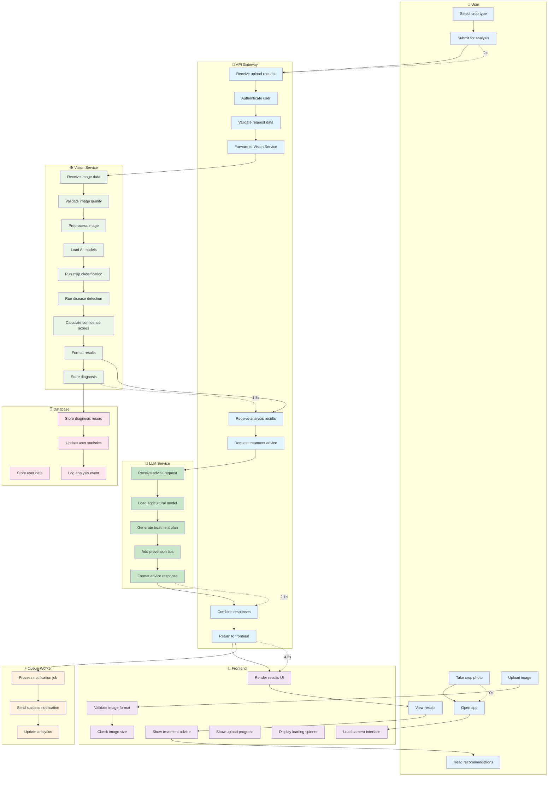
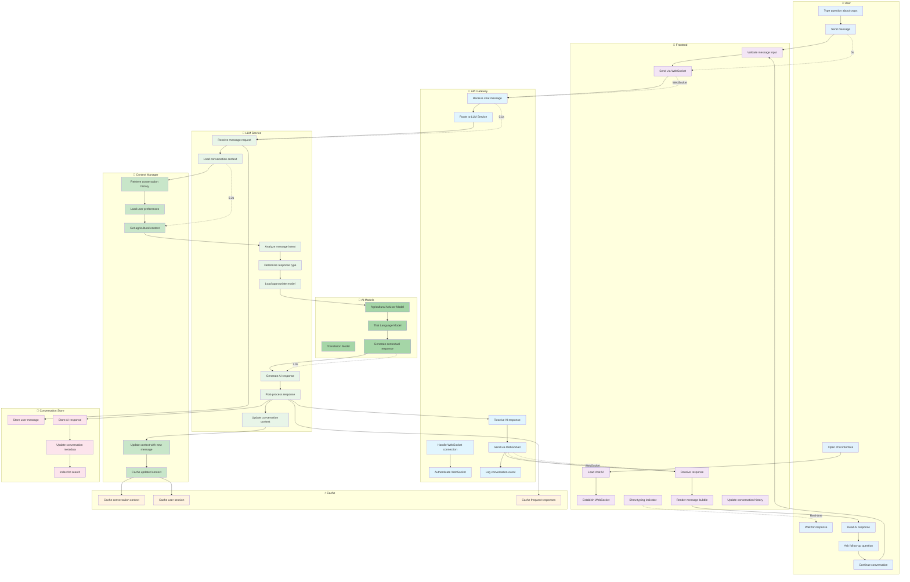
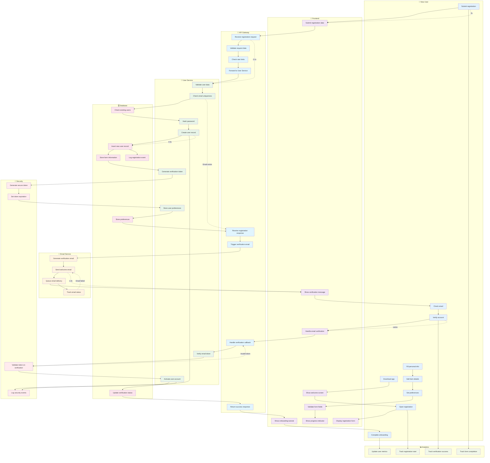
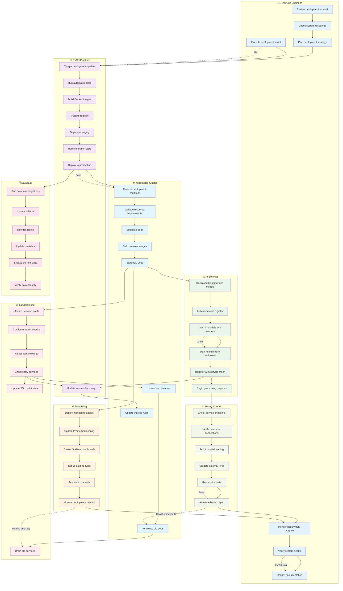
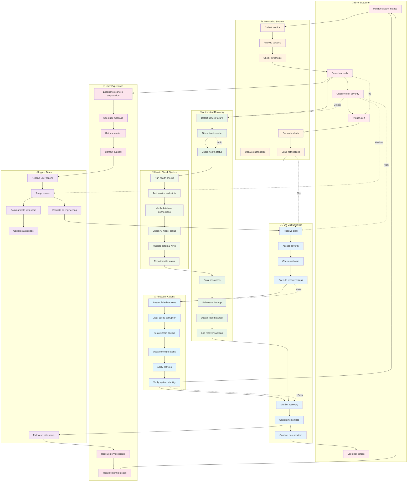

# Swimlane Diagrams

## Disease Detection Process Swimlane

## Chat Conversation Process Swimlane

## User Registration and Onboarding Swimlane

## System Deployment and Scaling Swimlane

## Error Handling and Recovery Swimlane

