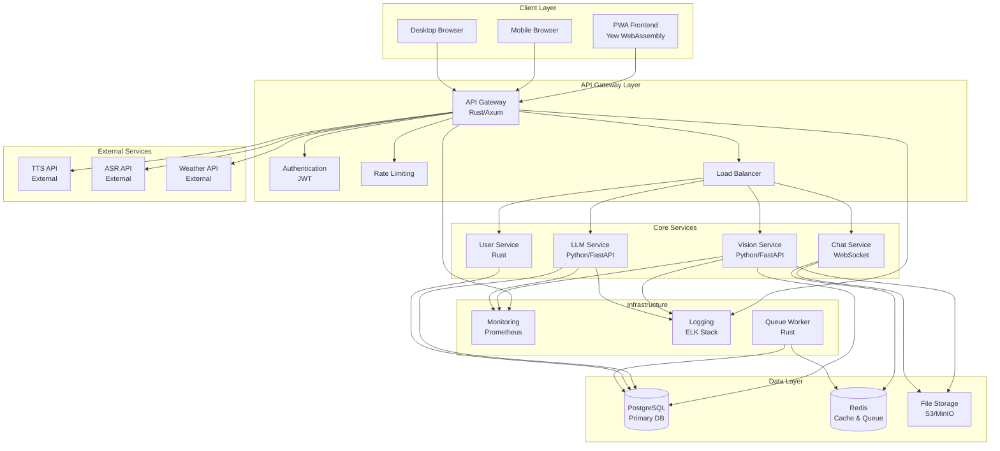
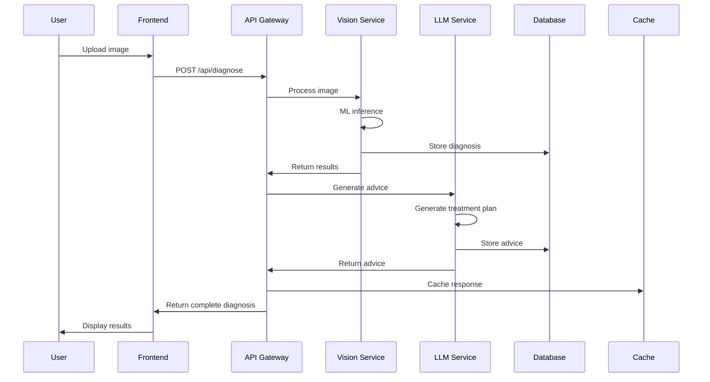
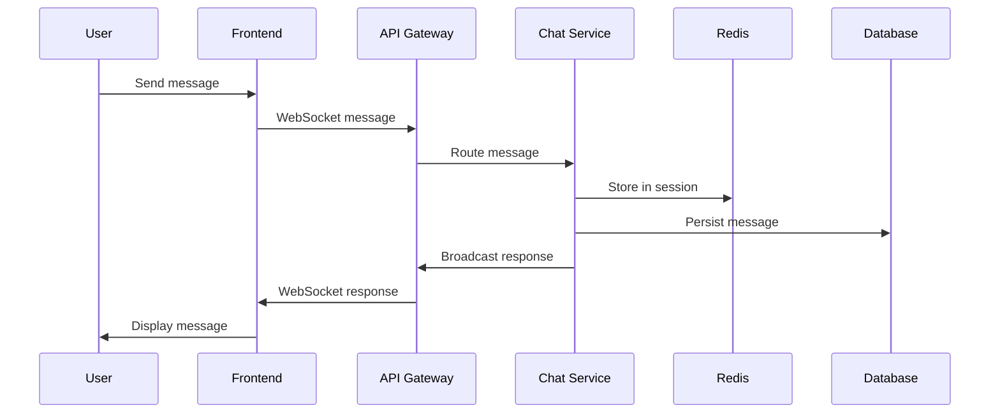

# System Design

## 🎯 Overview

AI4Thai Crop Guardian is a microservices-based system designed to provide AI-powered crop disease detection and advisory services to Thai farmers through a progressive web application.

## 🏗️ High-Level Architecture

## 🔧 Component Details

### Frontend Layer

#### Progressive Web Application (PWA)
- **Technology**: Yew (Rust WebAssembly)
- **Features**: Offline capability, native app experience
- **Responsibilities**:
  - User interface rendering
  - Camera integration
  - Voice input/output
  - Offline data synchronization
  - Push notifications

### API Gateway Layer

#### API Gateway
- **Technology**: Rust/Axum
- **Responsibilities**:
  - Request routing and load balancing
  - Authentication and authorization
  - Rate limiting and throttling
  - Request/response transformation
  - Circuit breaker implementation
  - Metrics collection

#### Authentication Service
- **Technology**: JWT with RS256
- **Features**:
  - User registration and login
  - Token generation and validation
  - Role-based access control
  - Session management

### Core Services

#### Vision Service
- **Technology**: Python/FastAPI
- **Responsibilities**:
  - Image preprocessing and validation
  - Disease detection using ML models
  - Confidence scoring
  - Result caching
- **Models**: 
  - Crop classification
  - Disease detection
  - Severity assessment

#### LLM Service
- **Technology**: Python/FastAPI
- **Responsibilities**:
  - Treatment recommendation generation
  - Natural language processing
  - Thai language support
  - Context-aware responses
- **Integration**: OpenAI GPT-4, Anthropic Claude

#### Chat Service
- **Technology**: Rust/Axum WebSocket
- **Responsibilities**:
  - Real-time messaging
  - Message history management
  - Multimodal message handling
  - Typing indicators

#### User Service
- **Technology**: Rust/Axum
- **Responsibilities**:
  - User profile management
  - Preference storage
  - Farm information tracking
  - Usage analytics

### External Services

#### Text-to-Speech (TTS)
- **Provider**: Google Cloud TTS / Azure Cognitive Services
- **Features**: Thai language support, natural voice synthesis

#### Automatic Speech Recognition (ASR)
- **Provider**: Google Cloud Speech / Azure Speech Services
- **Features**: Thai language recognition, noise reduction

#### Weather Service
- **Provider**: OpenWeatherMap / AccuWeather
- **Features**: Location-based weather data, forecasting

### Data Layer

#### PostgreSQL Database
- **Purpose**: Primary data store
- **Schema**:
  - Users and authentication
  - Chat conversations and messages
  - Disease diagnoses and history
  - Farm profiles and preferences

#### Redis Cache
- **Purpose**: Caching and job queue
- **Usage**:
  - Session storage
  - API response caching
  - Background job queue
  - Real-time data

#### File Storage
- **Technology**: MinIO (S3-compatible)
- **Purpose**: Image and audio file storage
- **Features**: Versioning, backup, CDN integration

## 🔄 Data Flow

### Disease Detection Flow

### Chat Flow

## 🔒 Security Design

### Authentication & Authorization
- **JWT Tokens**: RS256 signed tokens with short expiration
- **Refresh Tokens**: Secure token rotation
- **Role-Based Access**: User, Admin, System roles
- **API Keys**: Service-to-service authentication

### Data Protection
- **Encryption at Rest**: Database and file storage encryption
- **Encryption in Transit**: TLS 1.3 for all communications
- **Data Anonymization**: PII protection in logs and analytics
- **GDPR Compliance**: Data retention and deletion policies

### Network Security
- **API Gateway**: Single entry point with security controls
- **Rate Limiting**: Per-user and per-IP rate limits
- **DDoS Protection**: CloudFlare or AWS Shield
- **WAF**: Web Application Firewall rules

## 📊 Performance Design

### Caching Strategy
- **L1 Cache**: In-memory application cache
- **L2 Cache**: Redis distributed cache
- **L3 Cache**: CDN for static assets
- **Database Cache**: Query result caching

### Scalability Patterns
- **Horizontal Scaling**: Stateless service design
- **Load Balancing**: Round-robin with health checks
- **Auto-scaling**: CPU and memory-based scaling
- **Database Sharding**: User-based partitioning

### Performance Targets
- **API Response**: < 3 seconds (95th percentile)
- **Disease Detection**: < 2 seconds
- **Frontend Load**: < 2 seconds (First Contentful Paint)
- **Availability**: 99.9% uptime

## 🔍 Monitoring & Observability

### Metrics Collection
- **Application Metrics**: Request rates, response times, error rates
- **Business Metrics**: User engagement, diagnosis accuracy
- **Infrastructure Metrics**: CPU, memory, disk, network
- **Custom Metrics**: Disease detection confidence, user satisfaction

### Logging Strategy
- **Structured Logging**: JSON format with correlation IDs
- **Log Levels**: ERROR, WARN, INFO, DEBUG
- **Log Aggregation**: ELK Stack (Elasticsearch, Logstash, Kibana)
- **Log Retention**: 30 days for application logs, 90 days for audit logs

### Alerting
- **SLA Monitoring**: Availability and performance alerts
- **Error Rate Alerts**: Threshold-based error notifications
- **Business Alerts**: Unusual usage patterns
- **Infrastructure Alerts**: Resource utilization warnings

## 🚀 Deployment Architecture

### Development Environment
- **Local Development**: Docker Compose
- **Feature Branches**: Isolated testing environments
- **Integration Testing**: Automated test suites

### Staging Environment
- **Mirror Production**: Same architecture as production
- **Load Testing**: Performance validation
- **User Acceptance Testing**: Stakeholder validation

### Production Environment
- **Kubernetes Cluster**: Container orchestration
- **Multi-AZ Deployment**: High availability setup
- **Blue-Green Deployment**: Zero-downtime deployments
- **Disaster Recovery**: Cross-region backup and failover

## 🔄 Future Considerations

### Scalability Improvements
- **Event-Driven Architecture**: Async processing with message queues
- **CQRS Pattern**: Command Query Responsibility Segregation
- **Database Optimization**: Read replicas and connection pooling
- **Edge Computing**: Regional deployment for reduced latency

### Feature Enhancements
- **Real-time Collaboration**: Multi-user farm management
- **IoT Integration**: Sensor data integration
- **Advanced Analytics**: Predictive modeling and insights
- **Mobile Apps**: Native iOS and Android applications

---

This system design provides a robust, scalable, and maintainable architecture for the AI4Thai Crop Guardian platform.
