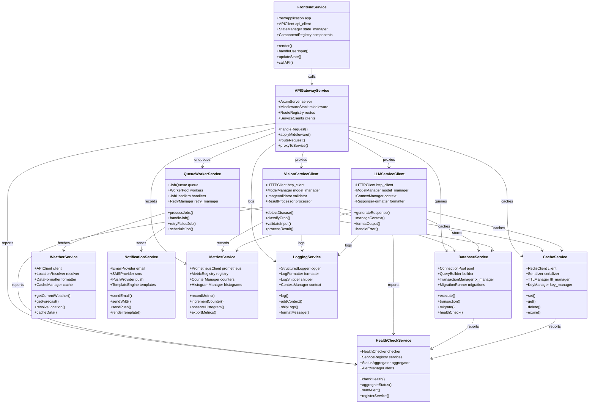

# UML Class Diagram

## System Architecture Class Diagram

```mermaid
classDiagram
    %% Core Domain Models
    class User {
        +String user_id
        +String email
        +String full_name
        +String phone
        +Location location
        +FarmInfo farm_info
        +UserPreferences preferences
        +DateTime created_at
        +DateTime updated_at
        +register()
        +login()
        +updateProfile()
        +getStatistics()
    }

    class Location {
        +String province
        +String district
        +Coordinates coordinates
        +String address
        +validateLocation()
    }

    class Coordinates {
        +Float lat
        +Float lng
        +calculateDistance()
        +isValid()
    }

    class FarmInfo {
        +Float farm_size
        +List~String~ primary_crops
        +Integer farming_experience
        +String farming_type
        +updateInfo()
    }

    class UserPreferences {
        +String language
        +NotificationSettings notifications
        +String theme
        +updatePreferences()
    }

    class NotificationSettings {
        +Boolean email
        +Boolean push
        +Boolean sms
        +List~String~ topics
    }

    %% Disease Detection Domain
    class Diagnosis {
        +String diagnosis_id
        +String user_id
        +String crop_type
        +String image_url
        +List~Disease~ diseases
        +Float confidence_score
        +ImageAnalysis image_analysis
        +List~Treatment~ treatments
        +DateTime created_at
        +generateReport()
        +getRecommendations()
    }

    class Disease {
        +String disease_id
        +String name
        +String scientific_name
        +Float confidence
        +String severity
        +List~String~ affected_parts
        +List~String~ symptoms
        +String description
        +List~BoundingBox~ bounding_boxes
        +getDetails()
    }

    class BoundingBox {
        +Integer x
        +Integer y
        +Integer width
        +Integer height
        +Float confidence
        +calculateArea()
    }

    class ImageAnalysis {
        +String image_quality
        +List~Integer~ resolution
        +Boolean crop_detected
        +Float crop_confidence
        +Float affected_area_percentage
        +String lighting_conditions
        +analyze()
    }

    class Treatment {
        +String treatment_id
        +String type
        +String treatment
        +String dosage
        +String frequency
        +String duration
        +String description
        +Cost estimated_cost
        +apply()
    }

    class Cost {
        +String amount
        +String currency
        +String breakdown
        +calculate()
    }

    %% Chat Domain
    class Conversation {
        +String conversation_id
        +String user_id
        +String title
        +List~Message~ messages
        +ConversationContext context
        +Integer message_count
        +DateTime created_at
        +DateTime last_updated
        +addMessage()
        +getHistory()
        +updateContext()
    }

    class Message {
        +String message_id
        +String conversation_id
        +String sender
        +String content
        +String message_type
        +String language
        +Float confidence
        +List~Attachment~ attachments
        +DateTime timestamp
        +send()
        +translate()
    }

    class Attachment {
        +String attachment_id
        +String type
        +String url
        +String filename
        +Integer size
        +upload()
        +download()
    }

    class ConversationContext {
        +String crop_type
        +String location
        +String season
        +List~String~ previous_diseases
        +Map~String,Any~ metadata
        +update()
        +getRelevantInfo()
    }

    %% AI Services Domain
    class VisionService {
        +ModelRegistry model_registry
        +ImageProcessor image_processor
        +InferenceEngine inference_engine
        +detectDisease()
        +classifyCrop()
        +analyzeBatch()
        +getModelInfo()
    }

    class ModelRegistry {
        +Map~String,Model~ models
        +loadModels()
        +getModel()
        +getModelStatus()
        +unloadModel()
    }

    class Model {
        +String model_name
        +String model_type
        +String status
        +Integer memory_usage
        +Float load_time
        +load()
        +unload()
        +predict()
    }

    class ImageProcessor {
        +processImage()
        +validateImage()
        +resize()
        +normalize()
        +augment()
    }

    class InferenceEngine {
        +ModelRegistry model_registry
        +predict()
        +predictBatch()
        +calculateConfidence()
        +postProcess()
    }

    class LLMService {
        +ModelRegistry model_registry
        +ChatEngine chat_engine
        +ContextManager context_manager
        +ResponseGenerator response_generator
        +processChat()
        +generateAdvice()
        +translate()
        +summarize()
    }

    class ChatEngine {
        +ModelRegistry model_registry
        +ContextManager context_manager
        +ResponseGenerator response_generator
        +processMessage()
        +generateResponse()
        +manageContext()
    }

    class ContextManager {
        +Map~String,Context~ contexts
        +getContext()
        +updateContext()
        +clearContext()
        +getConversationHistory()
    }

    class ResponseGenerator {
        +ModelRegistry model_registry
        +generate()
        +generateAdvice()
        +translate()
        +summarize()
        +formatResponse()
    }

    %% API Gateway Domain
    class APIGateway {
        +AuthService auth_service
        +RouteHandler route_handler
        +RateLimiter rate_limiter
        +handleRequest()
        +authenticate()
        +route()
        +applyRateLimit()
    }

    class AuthService {
        +JWTHandler jwt_handler
        +UserRepository user_repository
        +authenticate()
        +generateToken()
        +validateToken()
        +refreshToken()
    }

    class JWTHandler {
        +String secret_key
        +generateToken()
        +validateToken()
        +extractClaims()
        +isExpired()
    }

    class RouteHandler {
        +Map~String,Handler~ routes
        +addRoute()
        +handleRequest()
        +forwardRequest()
        +handleResponse()
    }

    class RateLimiter {
        +Map~String,RateLimit~ limits
        +checkLimit()
        +updateCounter()
        +resetCounter()
        +isExceeded()
    }

    %% Repository Layer
    class UserRepository {
        +DatabaseConnection db
        +create()
        +findById()
        +findByEmail()
        +update()
        +delete()
    }

    class DiagnosisRepository {
        +DatabaseConnection db
        +create()
        +findById()
        +findByUserId()
        +update()
        +delete()
        +findByDateRange()
    }

    class ConversationRepository {
        +DatabaseConnection db
        +create()
        +findById()
        +findByUserId()
        +update()
        +delete()
        +addMessage()
    }

    class CacheRepository {
        +RedisConnection redis
        +set()
        +get()
        +delete()
        +exists()
        +expire()
    }

    %% Infrastructure
    class DatabaseConnection {
        +String connection_string
        +connect()
        +disconnect()
        +execute()
        +transaction()
    }

    class RedisConnection {
        +String connection_string
        +connect()
        +disconnect()
        +set()
        +get()
        +delete()
    }

    class QueueWorker {
        +JobProcessor job_processor
        +processJobs()
        +handleJob()
        +retryJob()
        +failJob()
    }

    class JobProcessor {
        +processImageAnalysis()
        +processNotification()
        +processDataSync()
        +processCleanup()
    }

    %% Relationships
    User ||--|| Location : has
    Location ||--|| Coordinates : contains
    User ||--|| FarmInfo : has
    User ||--|| UserPreferences : has
    UserPreferences ||--|| NotificationSettings : contains

    User ||--o{ Diagnosis : creates
    Diagnosis ||--o{ Disease : contains
    Disease ||--o{ BoundingBox : has
    Diagnosis ||--|| ImageAnalysis : has
    Diagnosis ||--o{ Treatment : recommends
    Treatment ||--|| Cost : has

    User ||--o{ Conversation : participates
    Conversation ||--o{ Message : contains
    Message ||--o{ Attachment : has
    Conversation ||--|| ConversationContext : has

    VisionService ||--|| ModelRegistry : uses
    VisionService ||--|| ImageProcessor : uses
    VisionService ||--|| InferenceEngine : uses
    ModelRegistry ||--o{ Model : manages
    InferenceEngine ||--|| ModelRegistry : uses

    LLMService ||--|| ModelRegistry : uses
    LLMService ||--|| ChatEngine : uses
    LLMService ||--|| ContextManager : uses
    LLMService ||--|| ResponseGenerator : uses
    ChatEngine ||--|| ContextManager : uses
    ChatEngine ||--|| ResponseGenerator : uses
    ResponseGenerator ||--|| ModelRegistry : uses

    APIGateway ||--|| AuthService : uses
    APIGateway ||--|| RouteHandler : uses
    APIGateway ||--|| RateLimiter : uses
    AuthService ||--|| JWTHandler : uses
    AuthService ||--|| UserRepository : uses

    UserRepository ||--|| DatabaseConnection : uses
    DiagnosisRepository ||--|| DatabaseConnection : uses
    ConversationRepository ||--|| DatabaseConnection : uses
    CacheRepository ||--|| RedisConnection : uses

    QueueWorker ||--|| JobProcessor : uses
```

## Component Interaction Diagram


