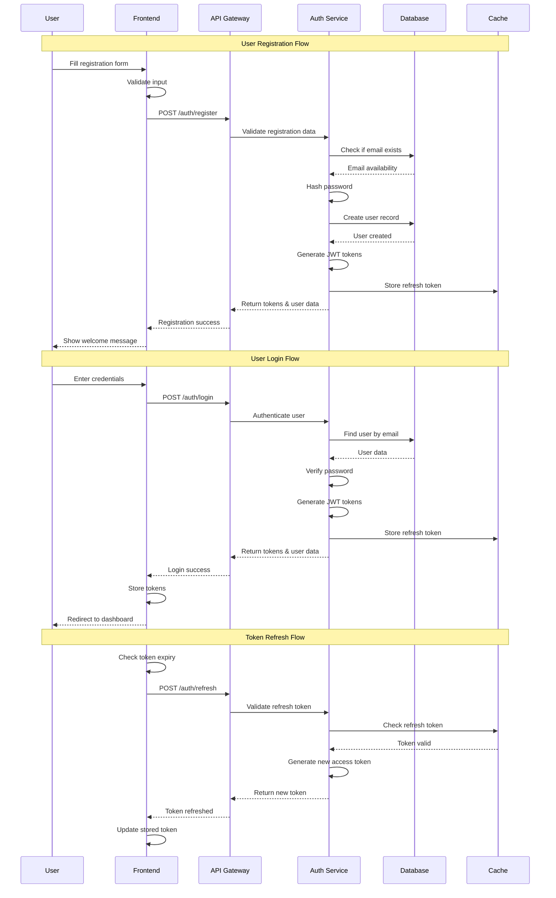
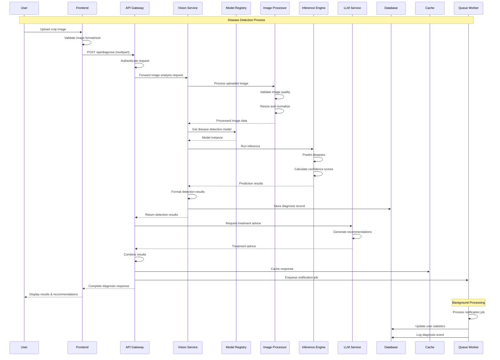
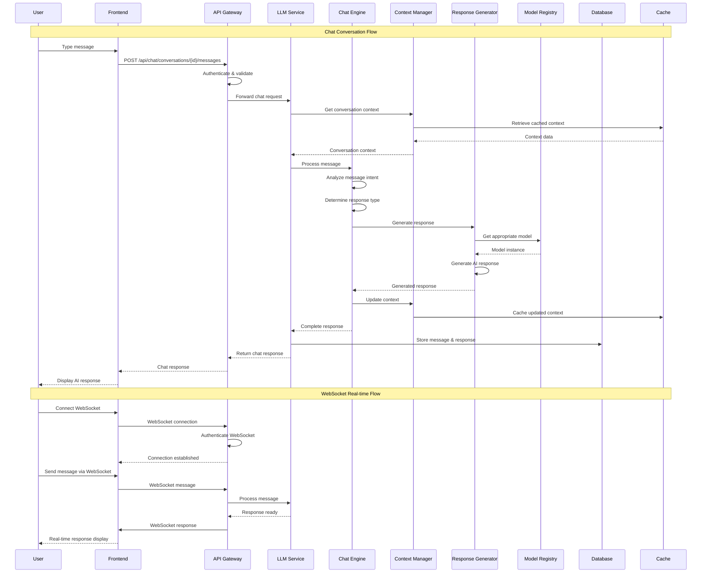
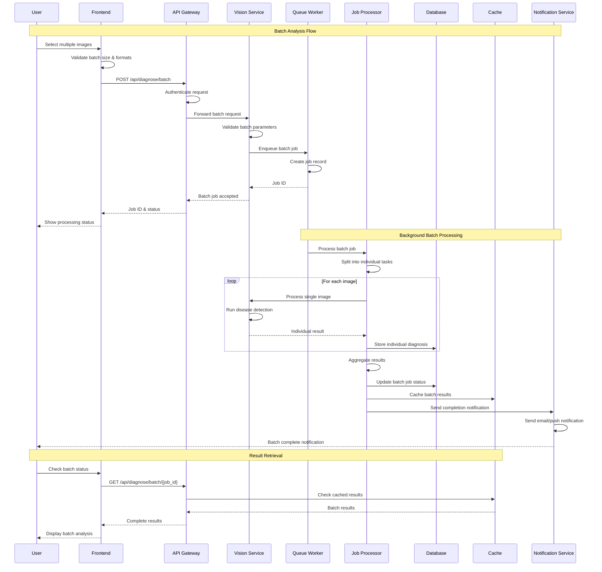
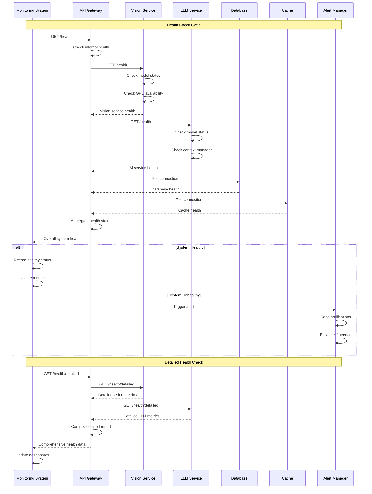
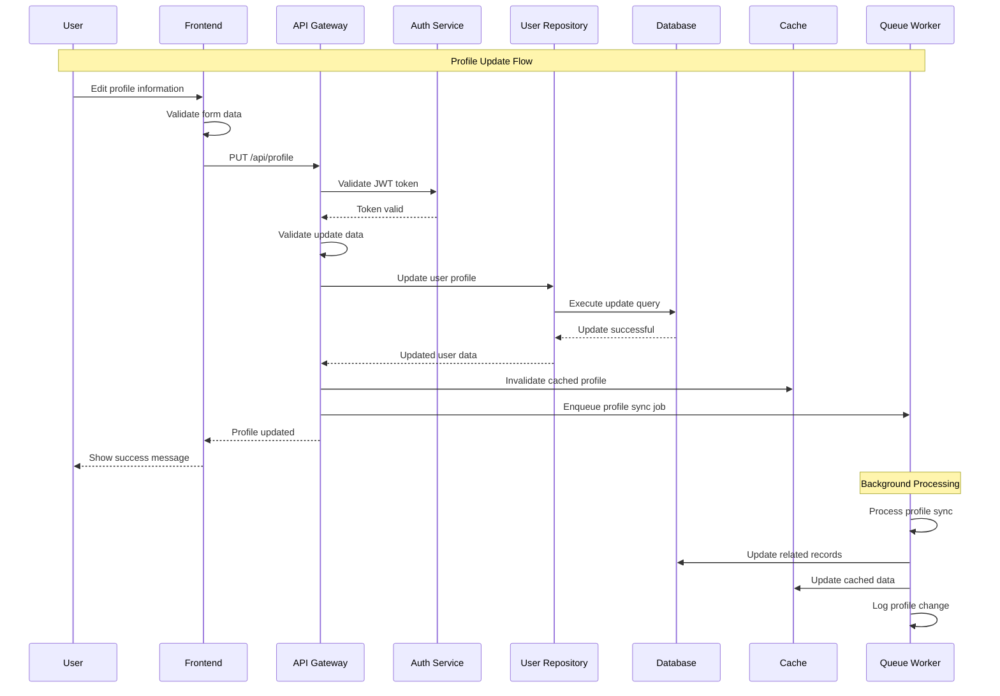
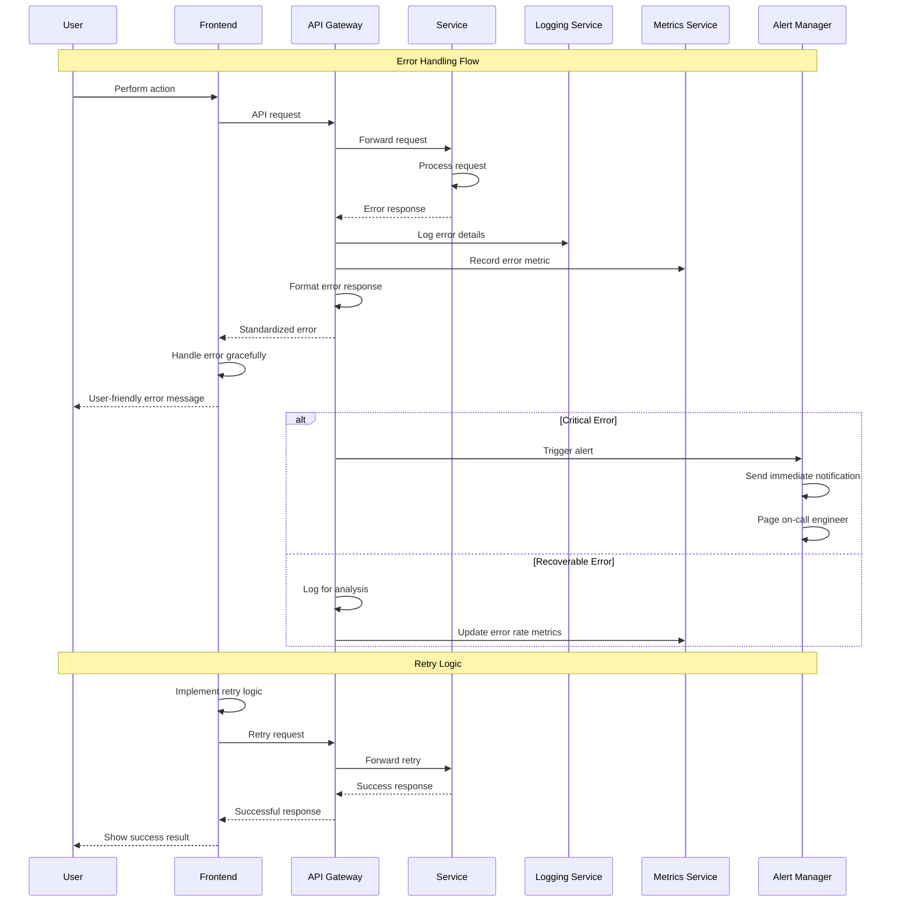

# UML Sequence Diagrams

## User Registration and Authentication Flow

## Disease Detection Flow

## Chat Conversation Flow

## Batch Image Analysis Flow

## System Health Check Flow

## User Profile Update Flow

## Error Handling Flow

