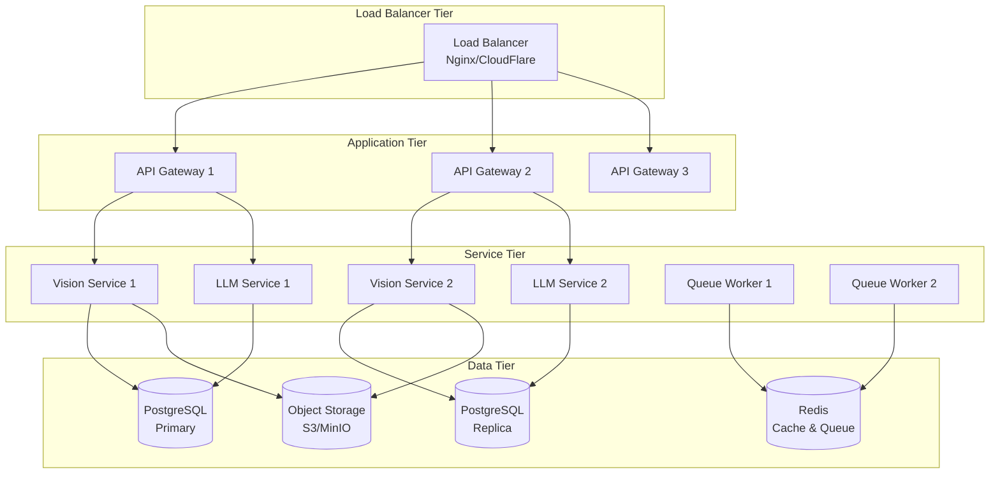

# Deployment Documentation

This section contains comprehensive deployment guides for the AI4Thai Crop Guardian system across different environments.

## 📋 Deployment Guides

### 🏠 [Local Development](local.md)
Setting up the development environment on your local machine.

### 🧪 [Staging Environment](staging.md)
Deploying to staging environment for testing and validation.

### 🚀 [Production Deployment](production.md)
Complete production deployment guide with best practices.

### ☁️ [Cloud Deployment](cloud.md)
Cloud-specific deployment guides for AWS, GCP, and Azure.

### 🐳 [Docker Deployment](docker.md)
Containerized deployment using Docker and Docker Compose.

### ☸️ [Kubernetes Deployment](kubernetes.md)
Kubernetes deployment with Helm charts and manifests.

## 🏗️ Infrastructure Overview

### Architecture Tiers



## 🌍 Environment Configuration

### Development Environment
- **Purpose**: Local development and testing
- **Resources**: Minimal resource requirements
- **Services**: All services on single machine
- **Database**: Local PostgreSQL and Redis
- **Monitoring**: Basic logging

### Staging Environment
- **Purpose**: Integration testing and QA
- **Resources**: Production-like but smaller scale
- **Services**: Containerized deployment
- **Database**: Shared database with production-like data
- **Monitoring**: Full monitoring stack

### Production Environment
- **Purpose**: Live user traffic
- **Resources**: High availability and performance
- **Services**: Multi-instance deployment
- **Database**: Clustered with replication
- **Monitoring**: Comprehensive monitoring and alerting

## 🔧 Deployment Requirements

### Minimum System Requirements

#### Development
- **CPU**: 4 cores
- **RAM**: 8GB
- **Storage**: 50GB SSD
- **Network**: Broadband internet

#### Staging
- **CPU**: 8 cores
- **RAM**: 16GB
- **Storage**: 100GB SSD
- **Network**: 1Gbps connection

#### Production
- **CPU**: 16+ cores (distributed)
- **RAM**: 32GB+ (distributed)
- **Storage**: 500GB+ SSD with backup
- **Network**: High-speed, redundant connections

### Software Dependencies

#### Core Dependencies
- **Docker**: 20.10+
- **Docker Compose**: 2.0+
- **Kubernetes**: 1.24+ (for K8s deployment)
- **Helm**: 3.8+ (for K8s deployment)

#### Database Dependencies
- **PostgreSQL**: 14+
- **Redis**: 6.2+

#### Monitoring Dependencies
- **Prometheus**: 2.35+
- **Grafana**: 8.5+
- **Elasticsearch**: 8.0+ (for logging)

## 🚀 Quick Deployment

### Docker Compose (Recommended for Development)
```bash
# Clone repository
git clone <repository-url>
cd ai4thai-crop-guardian

# Setup environment
cp .env.example .env
# Edit .env with your configuration

# Start all services
docker-compose up -d

# Check service status
docker-compose ps

# View logs
docker-compose logs -f
```

### Kubernetes (Recommended for Production)
```bash
# Install Helm chart
helm repo add ai4thai https://charts.ai4thai.com
helm repo update

# Deploy to production
helm install ai4thai-crop-guardian ai4thai/crop-guardian \
  --namespace production \
  --values production-values.yaml

# Check deployment status
kubectl get pods -n production
kubectl get services -n production
```

## 📊 Deployment Checklist

### Pre-Deployment
- [ ] Environment variables configured
- [ ] Database migrations ready
- [ ] SSL certificates obtained
- [ ] DNS records configured
- [ ] Monitoring setup complete
- [ ] Backup strategy implemented

### Deployment
- [ ] Services deployed successfully
- [ ] Health checks passing
- [ ] Database connections working
- [ ] External API integrations tested
- [ ] Load balancer configured
- [ ] SSL/TLS working

### Post-Deployment
- [ ] Smoke tests passed
- [ ] Performance tests completed
- [ ] Monitoring alerts configured
- [ ] Log aggregation working
- [ ] Backup verification
- [ ] Documentation updated

## 🔍 Monitoring and Health Checks

### Health Check Endpoints
- **API Gateway**: `GET /health`
- **Vision Service**: `GET /health`
- **LLM Service**: `GET /health`
- **Database**: Connection test
- **Redis**: Ping test

### Key Metrics to Monitor
- **Response Time**: API endpoint response times
- **Error Rate**: HTTP 4xx/5xx error rates
- **Throughput**: Requests per second
- **Resource Usage**: CPU, memory, disk usage
- **Database Performance**: Query times, connection pool

### Alerting Thresholds
- **Response Time**: > 5 seconds
- **Error Rate**: > 5%
- **CPU Usage**: > 80%
- **Memory Usage**: > 85%
- **Disk Usage**: > 90%

## 🔄 Deployment Strategies

### Blue-Green Deployment
1. Deploy new version to "green" environment
2. Test green environment thoroughly
3. Switch traffic from "blue" to "green"
4. Keep blue environment as rollback option

### Rolling Deployment
1. Deploy new version to subset of instances
2. Verify deployment health
3. Gradually roll out to remaining instances
4. Monitor throughout the process

### Canary Deployment
1. Deploy new version to small percentage of traffic
2. Monitor metrics and user feedback
3. Gradually increase traffic to new version
4. Full rollout or rollback based on results

## 🔒 Security Considerations

### Network Security
- **Firewall Rules**: Restrict access to necessary ports
- **VPN Access**: Secure access to internal services
- **SSL/TLS**: Encrypt all communications
- **API Gateway**: Single point of entry with security controls

### Application Security
- **Authentication**: JWT tokens with proper expiration
- **Authorization**: Role-based access control
- **Input Validation**: Sanitize all user inputs
- **Rate Limiting**: Prevent abuse and DoS attacks

### Data Security
- **Encryption at Rest**: Database and file storage encryption
- **Encryption in Transit**: TLS for all communications
- **Backup Encryption**: Encrypted backups
- **Access Logging**: Audit trail for data access

## 🆘 Troubleshooting

### Common Deployment Issues

#### Service Won't Start
1. Check environment variables
2. Verify database connectivity
3. Check port availability
4. Review service logs

#### Database Connection Issues
1. Verify database is running
2. Check connection string
3. Verify network connectivity
4. Check database user permissions

#### Performance Issues
1. Check resource utilization
2. Review database query performance
3. Verify caching is working
4. Check network latency

### Emergency Procedures

#### Service Outage
1. Check service health endpoints
2. Review recent deployments
3. Check infrastructure status
4. Implement rollback if necessary

#### Database Issues
1. Check database connectivity
2. Review database logs
3. Verify backup integrity
4. Consider failover to replica

## 📚 Additional Resources

- [Infrastructure as Code](../infrastructure/README.md)
- [Monitoring Setup](monitoring.md)
- [Backup and Recovery](backup-recovery.md)
- [Security Hardening](security.md)
- [Performance Tuning](performance.md)

---

For deployment questions or issues, please contact the DevOps team or create an issue in the repository.
