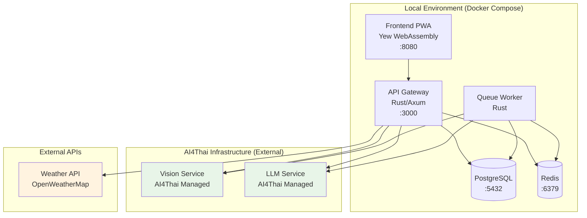

# Demo Deployment Guide

This guide explains how to deploy AI4Thai Crop Guardian for demonstration purposes with external AI services provided by AI4Thai.

## 🎯 Architecture Overview

### Simplified Demo Architecture



## 🚀 Quick Start

### Prerequisites

- Docker and Docker Compose installed
- AI4Thai API key (provided by AI4Thai team)
- Internet connection for external AI services

### 1. Clone and Setup

```bash
# Clone the repository
git clone https://github.com/your-org/ai4thai-crop-guardian.git
cd ai4thai-crop-guardian

# Copy environment configuration
cp .env.example .env
```

### 2. Configure Environment

Edit `.env` file with your configuration:

```bash
# Required: AI4Thai API Key (provided by AI4Thai team)
AI4THAI_API_KEY=your_ai4thai_api_key_here

# Optional: Weather API key for weather integration
WEATHER_API_KEY=your_weather_api_key_here

# Demo settings (can leave as default)
APP_ENV=demo
POSTGRES_PASSWORD=password
JWT_SECRET=demo-jwt-secret-change-in-production-12345
```

### 3. Start Services

```bash
# Start core services
docker-compose up -d

# Check service status
docker-compose ps

# View logs
docker-compose logs -f
```

### 4. Access Application

- **Frontend**: http://localhost:8080
- **API Gateway**: http://localhost:3000
- **API Health Check**: http://localhost:3000/health

## 🔧 Service Configuration

### Core Services (Local)

| Service | Port | Description |
|---------|------|-------------|
| Frontend | 8080 | Yew WebAssembly PWA |
| API Gateway | 3000 | Rust/Axum API server |
| PostgreSQL | 5432 | Primary database |
| Redis | 6379 | Cache and job queue |

### External Services (AI4Thai Managed)

| Service | URL | Description |
|---------|-----|-------------|
| Vision Service | https://vision-api.ai4thai.com | Crop disease detection |
| LLM Service | https://llm-api.ai4thai.com | AI advisory and chat |

## 🎮 Demo Features

### Available Functionality

1. **Crop Disease Detection**
   - Upload crop images
   - Get AI-powered disease identification
   - Receive treatment recommendations

2. **Chat Interface**
   - Text-based agricultural advice
   - Context-aware responses
   - Thai language support

3. **User Management**
   - User registration and login
   - Profile management
   - Farm information tracking

### Demo Data

The system includes sample data for demonstration:

- Sample crop types (Rice, Cassava, Durian, Mango, Rubber)
- Common disease examples
- Demo user account: `demo@ai4thai.com` / `demo123`

## 🔍 Monitoring and Debugging

### Health Checks

```bash
# Check all services
docker-compose ps

# Check API Gateway health
curl http://localhost:3000/health

# Check database connection
docker-compose exec postgres pg_isready -U postgres

# Check Redis connection
docker-compose exec redis redis-cli ping
```

### View Logs

```bash
# All services
docker-compose logs -f

# Specific service
docker-compose logs -f api-gateway
docker-compose logs -f frontend
docker-compose logs -f queue-worker
```

### Common Issues

#### Service Won't Start
```bash
# Check if ports are available
netstat -tulpn | grep :3000
netstat -tulpn | grep :8080

# Restart specific service
docker-compose restart api-gateway
```

#### Database Connection Issues
```bash
# Reset database
docker-compose down -v
docker-compose up -d postgres
# Wait for postgres to be ready, then start other services
docker-compose up -d
```

#### AI Service Connection Issues
```bash
# Test AI4Thai services connectivity
curl -H "Authorization: Bearer $AI4THAI_API_KEY" \
     https://vision-api.ai4thai.com/health

curl -H "Authorization: Bearer $AI4THAI_API_KEY" \
     https://llm-api.ai4thai.com/health
```

## 🛠️ Optional Services

### Enable File Storage (MinIO)

```bash
# Start with storage profile
docker-compose --profile storage up -d

# Access MinIO console
open http://localhost:9001
# Login: minioadmin / minioadmin123
```

### Enable Monitoring

```bash
# Start with monitoring profile
docker-compose --profile monitoring up -d

# Access monitoring
open http://localhost:9090  # Prometheus
open http://localhost:3001  # Grafana (admin/admin)
```

## 🔄 Development Workflow

### Making Changes

```bash
# Rebuild specific service after code changes
docker-compose build api-gateway
docker-compose up -d api-gateway

# Rebuild frontend
docker-compose build frontend
docker-compose up -d frontend
```

### Database Management

```bash
# Access database
docker-compose exec postgres psql -U postgres -d ai4thai

# Run migrations (if available)
docker-compose exec api-gateway ./migrate

# Backup database
docker-compose exec postgres pg_dump -U postgres ai4thai > backup.sql
```

## 🚀 Deployment Variations

### Development Mode

```bash
# Use development environment
export APP_ENV=development
export RUST_LOG=debug
docker-compose up -d
```

### Production-like Demo

```bash
# Use production-like settings
export APP_ENV=production
export RUST_LOG=warn
docker-compose up -d
```

## 🔒 Security Considerations

### Demo Security Settings

⚠️ **Warning**: These settings are for demonstration only!

- Default passwords are used
- JWT secret is not secure
- CORS is permissive
- Debug logging may be enabled

### For Production Deployment

- Change all default passwords
- Use secure JWT secrets
- Configure proper CORS origins
- Enable HTTPS
- Use production database
- Implement proper monitoring

## 📞 Support

### Getting Help

1. **Check logs**: `docker-compose logs -f`
2. **Verify configuration**: Check `.env` file
3. **Test connectivity**: Verify AI4Thai API key
4. **Contact team**: Reach out to AI4Thai support

### Troubleshooting Checklist

- [ ] Docker and Docker Compose installed
- [ ] AI4Thai API key configured
- [ ] Ports 3000 and 8080 available
- [ ] Internet connection for external services
- [ ] All services showing as "healthy" in `docker-compose ps`

---

This demo deployment provides a simplified way to showcase AI4Thai Crop Guardian functionality while leveraging the robust AI infrastructure provided by AI4Thai.
